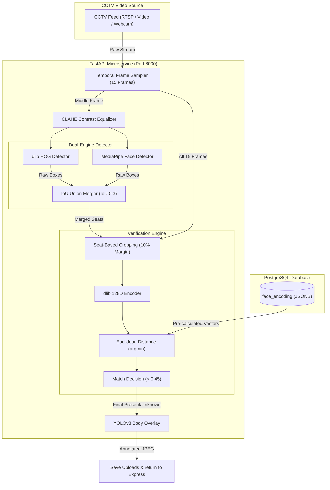

# Technical Documentation: Smart AI Attendance & Biometrics Subsystem

This document provides a detailed technical explanation of the **Smart Attendance Validation Subsystem** implemented for Thusitha Academy. It describes the dual-engine face detection pipeline, video-based temporal verification, matching algorithms, and integration architecture.

---

## 🏗️ 1. Subsystem Architecture Overview

The AI validation subsystem is split into a high-performance **Python FastAPI Microservice** (running computationally heavy computer vision models) and a **Node.js/Express Backend** (handling database state, Moodle REST sync, and Twilio alerts).

---

## 🔍 2. The Dual-Engine Face Detection Pipeline

Single face detection models fail in real-world classrooms due to distance, perspective distortion, and head turns:
1. **Google MediaPipe** downsamples high-resolution 1080p feeds internally to small dimensions (e.g. 256x256), washing out smaller student faces in the background rows.
2. **dlib HOG** processes high-resolution frames perfectly but fails to detect angled profile faces or students looking slightly away from the camera.

### **The Solution: IoU Union Merger**
The system runs both detectors in parallel and merges their coordinates using an **Intersection over Union (IoU)** matching algorithm:

1. **dlib HOG** runs with `number_of_times_to_upsample=1` to capture small, background faces.
2. **MediaPipe Face Detection** runs with a confidence sensitivity of `0.2` to capture side-profiles and angled heads.
3. **Union Merger**: Overlapping bounding boxes from both models are merged if their IoU exceeds `0.3`, ensuring no student is counted twice.
4. **CLAHE Equalization**: Prior to detection, the image luminance channel is equalized using **Contrast Limited Adaptive Histogram Equalization** to normalize features across diverse skin tones and shadows.

$$\text{IoU} = \frac{\text{Area of Intersection}}{\text{Area of Union}}$$

---

## 🎞️ 3. Video-Based Temporal Face Verification

Analyzing a single static frame leads to verification failure if a student blinks, looks down at their notebook, or is momentarily obscured by motion blur. 

### **Step-by-Step Temporal Verification Algorithm**

#### **Step 1: Frame Sampling**
Upon triggering validation, the microservice opens the camera stream and samples **15 frames** spread across **2-3 seconds** of video (sampling 1 frame every 4 frames to optimize CPU cycles).

#### **Step 2: Seat Locking**
Face detection runs on the middle representative frame. The coordinates (bounding boxes) are locked as "student seats" in the classroom.

#### **Step 3: Temporal Cropping**
For each locked student seat, the microservice crops that exact coordinate from **all 15 frames**, adding a **10% movement margin** to accommodate minor head swaying:

$$\text{Margin}_y = \text{Height} \times 0.1, \quad \text{Margin}_x = \text{Width} \times 0.1$$

#### **Step 4: Vector Extraction**
Small crops are converted to standard 8-bit RGB and processed by dlib's CNN face encoding model. Since the crop size is small (e.g., $100\times100$ pixels), generating the 128D encoding vector takes less than 1 millisecond.

#### **Step 5: Minimum Distance Matching (argmin)**
The database contains pre-calculated 128D vectors of all students expected in this session (scanned QR logs). For each seat, all generated crop vectors are compared against the expected database profiles:

$$\text{Distance} = \sqrt{\sum_{i=1}^{128} (v_{\text{expected}, i} - v_{\text{crop}, i})^2}$$

The matching engine selects the absolute minimum distance (`np.argmin`) across all 15 frames:

$$\text{Best Match} = \operatorname{argmin} (\text{Euclidean Distances})$$

#### **Step 6: Threshold Match Decision**
If the best match has a distance **$< 0.45$**, the student is verified (marked **green**). If the minimum distance is $\ge 0.45$, it is marked **red** (`Unknown`). This tight threshold prevents cross-gender name mappings.

---

## 🎨 4. YOLOv8 Headcount & Visual Overlays

To provide comprehensive audit support for administrators:
1. **YOLOv8 Bounding Boxes**: The service runs `yolov8n.pt` human body detection on the representative frame. It draws blue boxes (`(255, 0, 0)`) around detected bodies with a `"Person"` label.
2. **Safety Pipeline Execution Order**: YOLOv8 predictions and box overlays are drawn **only after** all facial locations and temporal encodings have been extracted. This guarantees that the face chips sent to the biometric encoder are never visually contaminated by blue lines or text labels.

---

## 💾 5. Database & Integration Layers

* **JSONB Vector Storage**: Student face profiles are precalculated from registry photos and stored as 128D JSON arrays in the `Students.face_encoding` column. This eliminates real-time encoding generation overhead during validation checks.
* **Master Record Sync**: Mismatch statistics, zone counts, and unverified student lists are committed as a JSON document to the `Attendance_Master` table, which in turn triggers automated Twilio alerts to staff if occupancy remains over-capacity.
